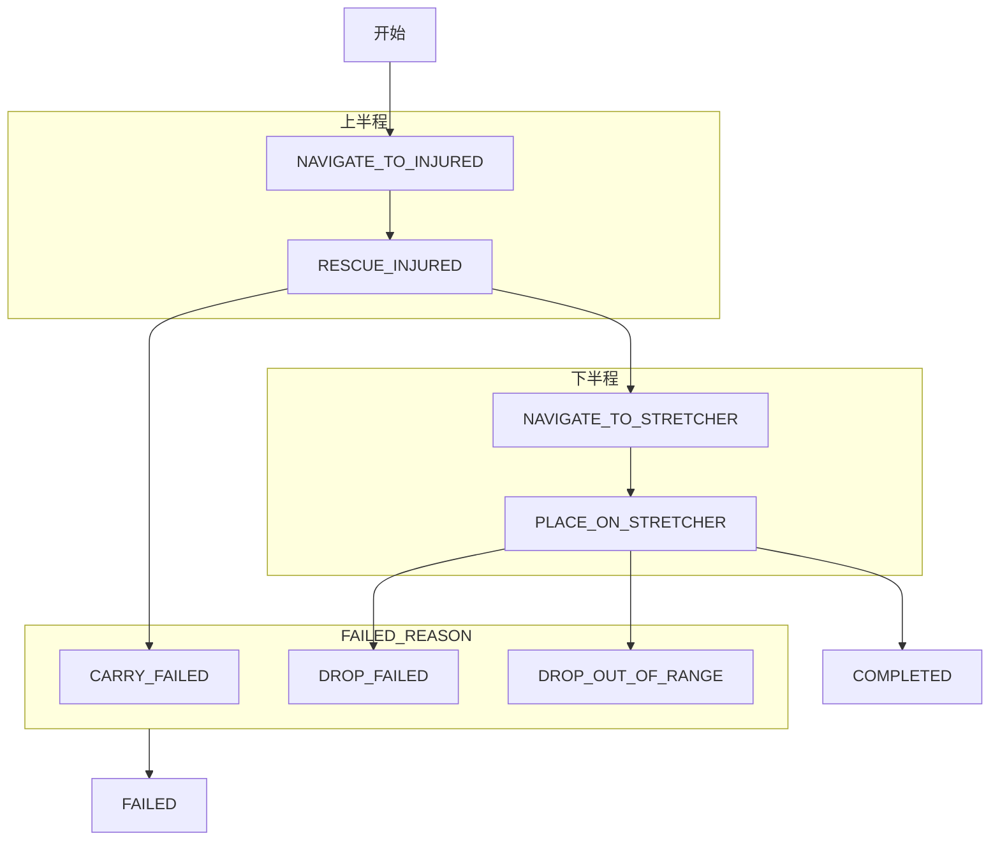

## 7个仿真场景

| 仿真场景               | 说明                | L1     | L2     | L3     | L4     | L5     | 合计      |
| ------------------ | ----------------- | ------ | ------ | ------ | ------ | ------ | ------- |
| FlexibleRoom       | 干净、简单的室内基础测试场景    | 25     | 0      | 0      | 0      | 0      | 25      |
| SuburbNeighborhood | 白天的郊区住宅社区         | 0      | 20     | 15     | 15     | 15     | 65      |
| Forglar Map        | Forglar 沙漠地形环境    | 0      | 9      | 8      | 8      | 8      | 33      |
| HongKong Street    | 高密度香港风格城市街区       | 0      | 10     | 7      | 6      | 8      | 31      |
| Tokyo              | 东京风格的模块化城市街道      | 0      | 6      | 10     | 10     | 0      | 26      |
| Downtown West      | 美国中西部风格的室外商业街/购物区 | 0      | 10     | 10     | 0      | 0      | 20      |
| Desert Map         | 相对开放的沙漠/自然地形      | 0      | 4      | 9      | 0      | 0      | 13      |
|                    |                   | **25** | **59** | **59** | **39** | **31** | **213** |

说明：
- 一个测试点代表一个完整的任务。如FlexibleRoom+L1的25个测试点表示25个不同的任务，而非一次任务的25个检测点。
- `--levels 0 --episodes 5`的episodes表示每个测试点进行5次测试，这个参数表示多次重复测试的次数。

## 5级任务难度

|难度|目标距离|高度变化|门、通道等交互|主要意义|
|---|---|---|---|---|
|L1|5–15米|不允许|不要求|干净近距离基础能力|
|L2|5–30米|不允许|不要求|复杂视觉背景下的近距离定位|
|L3|10–40米|可以出现|不要求|开始要求主动探索|
|L4|10–60米|可以出现|必须出现|跨区域、门或通道交互|
|L5|10–80米|必须出现|必须出现|多楼层、长距离、层次化导航|

## 4阶段任务划分

| 半程        | 阶段   | 任务                 | 目标               |
| --------- | ---- | ------------------ | ---------------- |
| 找到并抱起伤员   | `S1` | Explore            | 靠近伤员至水平距离 7.5 米内 |
| 找到并抱起伤员   | `S2` | Locate and Rescue  | 抱起伤员             |
| 找到担架并放下伤员 | `S3` | Return             | 靠近担架至水平距离 7.5 米内 |
| 找到担架并放下伤员 | `S4` | Locate and Handoff | 放下伤员             |

说明：
- JSONL 数据同时提供`stretcher_loc`和`ambulance_loc`，但是两者是有一定空间距离差别的，实际评分只考虑担架，没有考虑救护车。
- 上半程的伤员图像 ref_image 环境直接提供。下半程的担架图像并没有直接提供，而只有`stretcher_loc`坐标。一个合理的猜测是，测评平台希望模型自己根据空间记忆回到起点附近找到担架。

## 关键路径

### 上半程人员图

这些都是仿真器直接提供的，在云服务器上的搜索路径为：
/root/autodl-tmp/rescue-nomad/repos/RescueBench/
└── gym_rescue/envs/setting/ref_image/
    └── <JSONL中的reference_image_path>

### 下半程担架图

官方没有直接给担架图。但是nomad似乎有明确的搜索机制，针对`/root/autodl-tmp/rescue-nomad/topomaps`，现在不清楚这个搜索机制是只有nomad有还是全部都有。
<point_id>.png
<point_id>.jpg
level_<level>_<point_id>.png
level_<level>_<point_id>.jpg
<env>_level_<level>_<point_id>.png
<env>_level_<level>_<point_id>.jpg
<env>.png
<env>.jpg

## 拓扑地图

创建拓扑地图的路径
/root/autodl-tmp/rescue-nomad/topomaps/
启动 NoMaD 时应该明确传入这样才能用上这个拓扑图：
--topomap-dir /root/autodl-tmp/rescue-nomad/topomaps

### 拓扑图的作用

这是 RescueBench 适配器通用的部分。

拓扑图的路径分为两大类：
- `/root/autodl-tmp/rescue-nomad/topomaps/images/` 拓扑节点图
- `/root/autodl-tmp/rescue-nomad/topomaps/UnrealRescue-*/images/` 拓扑节点图
- `/root/autodl-tmp/rescue-nomad/topomaps/stretcher/` 担架语义目标图

根据这个目录来看，拓扑图似乎是每个模型测评时直接生成的，那它们的依据是什么？不同模型的拓扑图内容相同吗？
既然现在知道`stretcher/`下面是自己保存的担架目标图，那`images/`下面到底保存的图是什么类型的？

## 状态机

该状态机省略了回到前序状态的变化，也省了了超时的错误原因。

## 辅助操作机制

对无原生交互能力的模型，RescueBench 在满足几何条件后代为触发交互动作；抱起和放下是否成功仍由仿真器反馈决定，不能保证。开门甚至缺少明确的成功反馈检查。

| 辅助操作类型 |
| ------ |
| 接近伤员   |
| 放下伤员   |
| 开门     |
